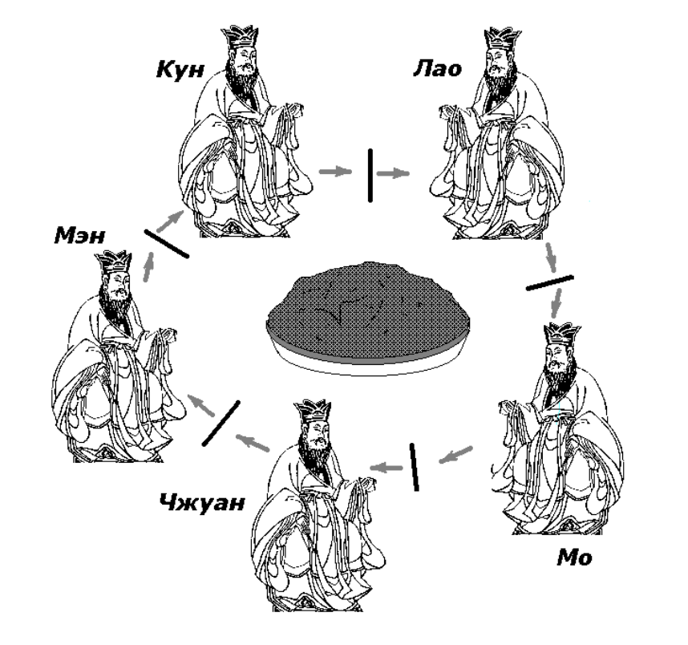

# Philosophers
<h1 align="center">
</h1>
<h2>Классическая задача об обедающих философов</h2>
<h3>Задача была сформулирована в 1965 году Эдсгером Дейкстрой как экзаменационное упражнение для студентов. В качестве примера был взят конкурирующий доступ к ленточному накопителю. Вскоре задача была сформулирована Энтони Хоаром в том виде, в каком она известна сегодня</h3>
<h2>Постановка задачи</h2>

<h3>Иллюстрация проблемы обедающих философов
Пять безмолвных философов сидят вокруг круглого стола, перед каждым философом стоит тарелка спагетти. Вилки лежат на столе между каждой парой ближайших философов.

Каждый философ может либо есть, либо размышлять. Приём пищи не ограничен количеством оставшихся спагетти — подразумевается бесконечный запас. Тем не менее, философ может есть только тогда, когда держит две вилки — взятую справа и слева (альтернативная формулировка проблемы подразумевает миски с рисом и палочки для еды вместо тарелок со спагетти и вилок).

Каждый философ может взять ближайшую вилку (если она доступна) или положить — если он уже держит её. Взятие каждой вилки и возвращение её на стол являются раздельными действиями, которые должны выполняться одно за другим.

Вопрос задачи заключается в том, чтобы разработать модель поведения (параллельный алгоритм), при котором ни один из философов не будет голодать, то есть будет вечно чередовать приём пищи и размышления.</h3>

<h2>Проблемы</h2>
<h3>Задача сформулирована таким образом, чтобы иллюстрировать проблему избежания взаимной блокировки (англ. deadlock) — состояния системы, при котором прогресс невозможен.

Например, можно посоветовать каждому философу выполнять следующий алгоритм:
<ul>
   <li>Размышлять, пока не освободится левая вилка. Когда вилка освободится — взять её.</li>
   <li>Размышлять, пока не освободится правая вилка. Когда вилка освободится — взять её.</li>
   <li>Есть</li>
   <li>Положить левую вилку</li>
   <li>Положить правую вилку</li>
   <li>Повторить алгоритм сначала</li>
</ul>
</h3>
<h2>Решение задачи</h2>
<h3>Решение задачи осуществлено двумя способами. С использованием мьютексов, если философы это потоки (в основной части).</h3>
<h3>И с ипользованием семафоров, когда философы процессы (в бонусной части)</h3>

<h3>Your(s) program(s) should take the following arguments:
number_of_philosophers time_to_die time_to_eat time_to_sleep
[number_of_times_each_philosopher_must_eat]
◦ number_of_philosophers: The number of philosophers and also the number
of forks.
◦ time_to_die (in milliseconds): If a philosopher didn’t start eating time_to_die
milliseconds since the beginning of their last meal or the beginning of the simulation, they die.
◦ time_to_eat (in milliseconds): The time it takes for a philosopher to eat.
During that time, they will need to hold two forks.
◦ time_to_sleep (in milliseconds): The time a philosopher will spend sleeping.
◦ number_of_times_each_philosopher_must_eat (optional argument): If all
philosophers have eaten at least number_of_times_each_philosopher_must_eat
times, the simulation stops. If not specified, the simulation stops when a
philosopher dies.</h3>
<h3></h3>
<h2>./philo 5 800 300 200 3</h2>
<h2>./philo_bonus 5 800 300 200 3</h2>
<h3>название программы, количество философов 5, время жизни без пищи 800, время еды 300, время сна 200, количество приемов пищи (не обязательно) 3</h3>